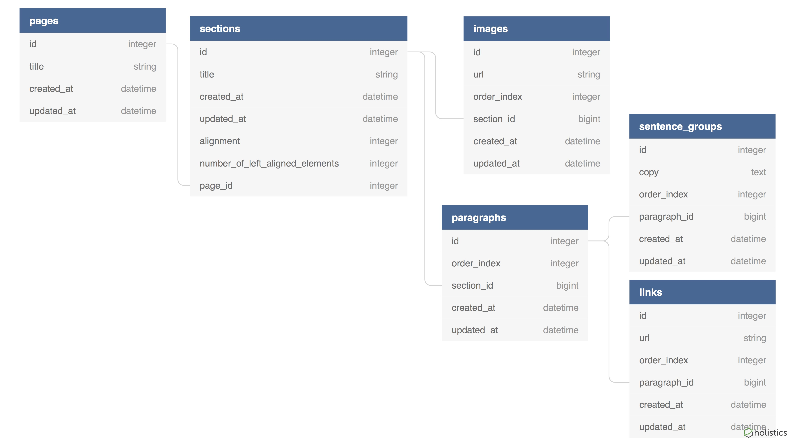

## Overview
This is an API that serves data for a professional portfolio website.

It uses Ruby 2.6.0, Rails 5.2.2. All other dependencies are specified in the Gemfile.

## Endpoints
There is only one endpoint: '/api/v1/pages'. By only using a single endpoint, the front-end application can get everything it needs from one single request instead of making multiple round-trip requests.

The API listens for a GET request to '/api/v1/pages' and responds with JSON in a format that corresponds to the database schema.

As of the time of writing, the API is deployed to production at:
[https://d333gjjjwdp7y8.cloudfront.net/api/v1/pages](https://d333gjjjwdp7y8.cloudfront.net/api/v1/pages)

## Schema
The database schema can be visualized as follows:

Pages are the top level class that represents different pages in the front-end app. A page has a title that is a string.

A Page has many Sections. A section is a visually segregated portion of a page. A section has a title that is a string, and has a page\_id as a foreign key relation to a page. A section has an alignment attribute that represents either centered alignment in the UI or split along the center with content on both the left and right sides of the UI. This alignment attribute is an enum where 0 corresponds to centered alignment, and 1 corresponds to split along the center. A section also has a number\_of\_left\_aligned\_elements attribute that represents the number of paragraphs or images that will be displayed on the left side (if the section is split along the center).

A Section can have many Images. An image has a section\_id as a foreign key relation. An image has a url that is a string pointing to an object in an Amazon S3 bucket. An image has an order\_index which is an integer that represents the order of how the image will be displayed in a section (an image with an order\_index of 0 will be displayed earlier in the HTML than an image with an order\_index of 1).

A Section can have many Paragraphs. A paragraph has a section\_id, as well as an order_index that determines its order of placement in a section.

A Paragraph can have many SentenceGroups that are blocks of plain text. A sentence group has a paragraph\_id, as well as an order\_index to determine its order of placement in its paragraph. A sentence group has a copy attribute of the type text.

A Paragraph can also have many Links. A link is a clickable HTML hyperlink. A link has a paragraph\_id, an order\_index to determine its order of placement in the paragraph, and a url attribute that is a string representing the hyperlink URL.

ActiveRecord also creates an integer primary key for each record, as well as datetime created\_at and updated\_at attributes.

## Setting up the API locally

To run the API on your local machine, follow these steps in a terminal:

Clone the repo:
`$ git clone https://github.com/nickedwards109/personal-site-api.git`

Move into the application's root directory:
`$ cd personal-site-api`

Install the dependencies:
`$ bundle install`

Create a database:
`$ rake db:create`

Migrate the database schema:
`$ rake db:migrate`

Run a rails console and create a minimum of one Page, a Section, an Image, a Paragraph, a SentenceGroup, and a Link.  
`$ rails console`

`>> Page.create(title: "Projects")`

`>> Section.create(page_id: 1, title: "This is a Project", alignment: "center", number_of_left_aligned_elements: 1)`

`>> Image.create(section_id: 1, url: "https://some-image-url.jpg")`

`>> Paragraph.create(section_id: 1, order_index: 0)`

`>> SentenceGroup.create(paragraph_id: 1, order_index: 0, copy: 'This is a sentence. This is another sentence.')`

`>> Link.create(paragraph_id: 1, order_index: 1, url: 'https://www.github.com/')`

`>> exit`

Run a local server:
`$ rails s`

Visit 'http://localhost:3000/api/v1/pages' in your browser!

## Running the tests
Run:
`$ rspec spec`
